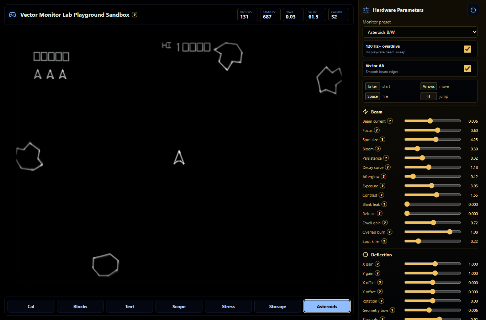
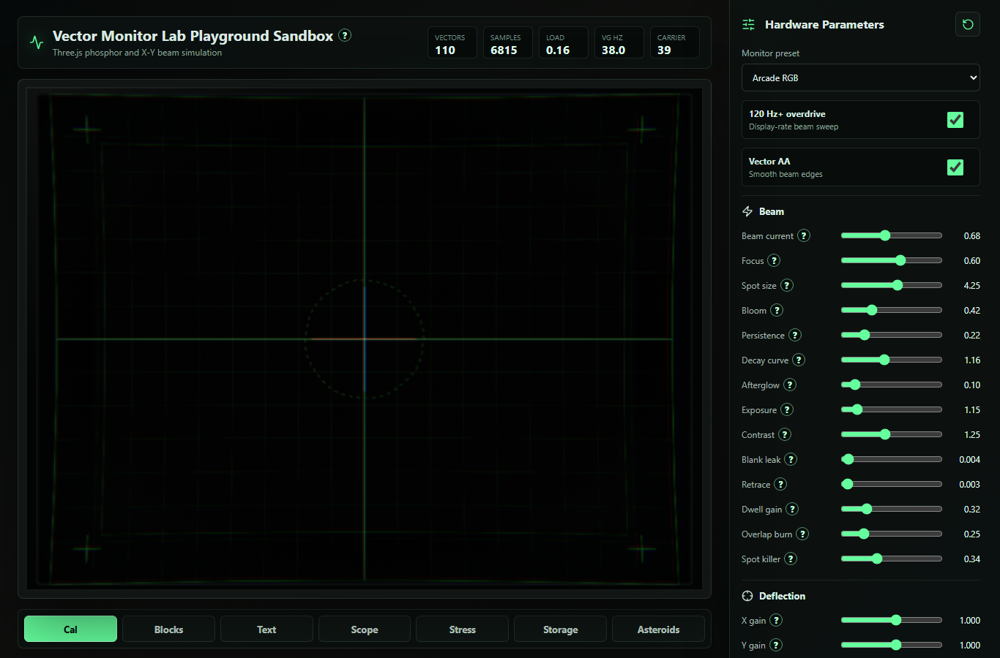
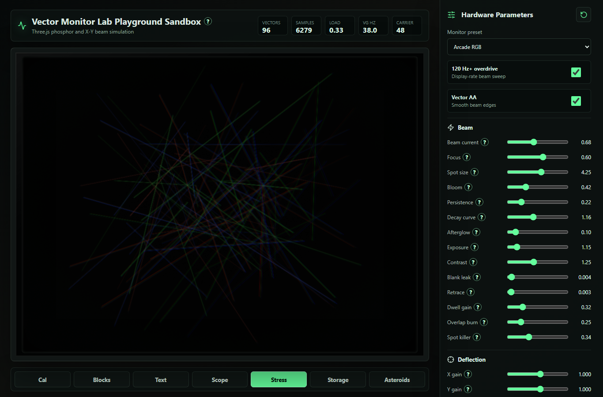
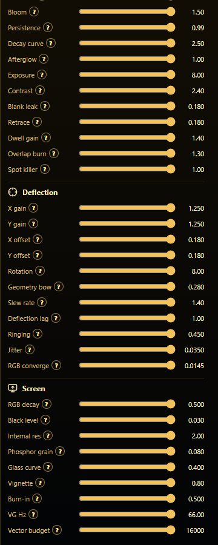

# Vector Monitor Lab

Vector Monitor Lab is a Three.js/TypeScript vector-monitor simulation library and sandbox for old CRT X-Y/vector displays. It models a steered electron beam depositing energy into a phosphor surface instead of drawing ordinary canvas lines.

The project has two main parts:

- **Vector Screen API**: a reusable renderer and command-stream API in [`src/core`](src/core).
- **Sandbox**: a live React/Vite playground with scenes, hardware sliders, and a playable Asteroids-style reproduction in [`src/App.tsx`](src/App.tsx), [`src/scenes`](src/scenes), and [`src/game`](src/game).

Full implementation details are in [`docs/implementation-report.md`](docs/implementation-report.md).

## Screenshots

| Asteroids | Calibration |
| --- | --- |
|  |  |

| Stress Scene | Hardware Panel |
| --- | --- |
|  |  |

## What It Simulates

- Beam current, focus, spot size, bloom, exposure, contrast, and black level.
- Phosphor persistence, decay curve, afterglow, grain, burn-in, and storage-style behavior.
- Blanking leakage, retrace visibility, dwell gain, corner brightening, and hotspot overlap.
- X/Y gain, offset, rotation, distortion, slew rate, deflection lag, ringing, and jitter.
- RGB convergence and per-channel decay for color vector-display looks.
- Separate modern display carrier refresh from simulated vector-generator refresh.

The Asteroids preset uses a `61.5234375 Hz` vector-generator cadence. Generic non-storage presets stay near the classic `30-40 Hz` vector-monitor range, while storage mode redraws much more slowly.

## API And Sandbox Split

### Vector Screen API

The API consumes a compact beam command stream:

```ts
import { VectorMonitor, VectorProgram, paramsForPreset } from "./src/core";

const canvas = document.querySelector("canvas")!;
const monitor = new VectorMonitor(canvas, paramsForPreset("arcade-rgb"));

const program = new VectorProgram()
  .moveTo(-0.8, -0.5)
  .color(0.25, 1, 0.35)
  .lineTo(0.8, -0.5, 0.85)
  .lineTo(0, 0.6, 0.85)
  .lineTo(-0.8, -0.5, 0.85);

function frame(now: number) {
  if (monitor.needsProgramRefresh(now / 1000)) {
    monitor.setProgram(program.commands);
  }
  monitor.render(1 / 60, now / 1000);
  requestAnimationFrame(frame);
}

requestAnimationFrame(frame);
```

See [`docs/api.md`](docs/api.md) and the Vector Screen API section of [`docs/implementation-report.md`](docs/implementation-report.md#vector-screen-api).

### Sandbox

The sandbox opens directly into the monitor simulation. It includes:

- Scene tabs: Cal, Blocks, Text, Scope, Stress, Storage, and Asteroids.
- A hardware control panel with 34 live sliders.
- Readouts for vectors, samples, phosphor load, simulated VG Hz, and browser carrier FPS.
- A playable Asteroids-style vector game using the same renderer.
- Local audit scripts for scenes, sliders, and performance.

See the Sandbox section of [`docs/implementation-report.md`](docs/implementation-report.md#sandbox).

## Run Locally

```powershell
npm install
npm run dev -- --port 5173
```

Open:

```text
http://127.0.0.1:5173
```

Build:

```powershell
npm run build
```

Preview the production build:

```powershell
npm run preview
```

## Audits

```powershell
npm run audit:modes
npm run audit:sliders
npm run audit:performance
```

Latest local verification before publishing:

- `npm run build` passed.
- Mode audit passed across 7 scenes, 6 presets, overdrive states, and AA states.
- Slider audit passed 68/68 slider checks.
- Performance audit reached 60 FPS for Asteroids on/off and Stress with carrier sweep on; Stress with carrier sweep off measured 57.4 FPS with 9 long frames.

## Source Material And Research

The implementation is based on public technical references about vector monitors, CRT phosphor behavior, Atari/arcade X-Y monitors, storage terminals, and vector synthesis.

Primary references:

- [Wikipedia: Vector monitor](https://en.wikipedia.org/wiki/Vector_monitor)
- [Jed Margolin: The Secret Life of X-Y Monitors](https://www.jmargolin.com/xy/xymon.pdf)
- [Jed Margolin: The Atari Color X-Y Monitor](https://www.jmargolin.com/vgens/vgens.htm)
- [Atari Quadrascan Color X-Y Display service manual](https://manualzz.com/doc/11348630/atari-quadrascan-color-x-y-display-service-manual)
- [TekWiki: Tektronix 4010](https://w140.com/tekwiki/wiki/4010)
- [Tektronix PLOT-10 Terminal Control System User's Manual](https://w140.com/tekwiki/images/2/20/062-1288-00.pdf)
- [HP Journal, December 1967](https://vtda.org/pubs/HP_Journal/HP_Journal_1967-12.pdf)
- [Derek Holzer: Vector Synthesis](https://macumbista.net/wp-content/uploads/2018/12/VectorSynthesis_DerekHolzer_2018.pdf)
- [Alvy Ray Smith: Special Effects for Star Trek II: The Genesis Demo](https://alvyray.com/Papers/CG/StarTrekII.pdf)

More source mapping is in [`docs/references.md`](docs/references.md), and the project scope is captured in [`VECTOR_MONITOR_PRD.md`](VECTOR_MONITOR_PRD.md).

## Creator Note

This project was created by Jason Cohen, a non-technical coder using Codex as a hands-on collaborator. The point of this repo is not just nostalgia; it is proof that modern AI coding tools can let someone with a strong idea, curiosity, and taste build real software without having to come from a traditional engineering background.

For Jason, the project reaches back to the original computer and arcade days: being a young kid staring at glowing vector graphics, imagining impossible machines, and feeling that spark of wanting to make the screen come alive. Codex made it possible to turn that feeling into a working renderer, a sandbox, audits, documentation, and a playable vector arcade reproduction through iteration, testing, and conversation.

## Asteroids Audio Note

The local Asteroids mode uses WAV samples under `public/sounds/asteroids`. These are user-supplied reference samples that came from outside this project so the sandbox can reproduce the cabinet-style sound events while tuning gameplay and beam rendering.

Downstream users should verify the rights for those samples before redistributing them in another package, commercial build, or public release. The required sample names are documented in [`public/sounds/asteroids/README.md`](public/sounds/asteroids/README.md).

## Status

This is an active experimental project. It is not a hardware-accurate emulator and does not ship arcade ROM vector tables. The Asteroids mode is source-informed and hand-authored for this renderer.
